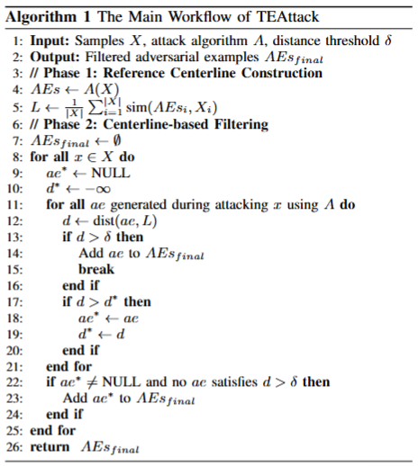

# TEAttack

[](LICENSE)
[](https://www.python.org/)

This repository contains the code for our paper:  
**An Empirical Study on Transferable Identifier-Level Adversarial Example Generation in\\Code Language Models**  
*作者列表*  

We conduct an empirical study on transferable AE generation and propose a novel method called TEAttack to enhance transferable AE generation across CodeLMs.

---

## Background

Our study yields three findings. First, across different attack approaches, we compare candidate identifier sources (how replacement identifiers are obtained) and search algorithms (how substitutions are selected), finding that transferable AE generation benefits more from effective candidate identifier sources and search algorithms than from strict semantic guidance. Second, across different source CodeLMs (the models used to generate AEs), transferable AE generation strongly depends on the source model and exhibits clear asymmetry, while we identify a phenomenon termed the illusion of robustness. Third, from the perspective of perturbation, using the average similarity between AEs and clean samples as a reference, transferable AEs consistently exhibit larger deviations.
Motivated by our findings on attack approaches and perturbations, we propose TEAttack (Transferability-Enhanced adversarial Attack), an approach designed to enhance transferable AE generation across CodeLMs.

---

## Method Overview

  

---

## Requirements

- Python 3.8+
- See `requirements.txt` for full list.

If you use GPU, please ensure CUDA 11.x+ is installed.

---

## Installation

bash

```shell
git clone https://github.com/Chen20240577/TEAttack.git
cd TEAttack
pip install -r requirements.txt

```
If the built parser "parser/my-languages.so" doesn't work for you, please rebuild as the following command:

```shell
cd python_parser/parser_folder
bash build.sh
```
---

## Usage

### Reproduce Empirical Study

bash
```shell
cd CodeLM_name/task_name/approach_name/
python **_disturb.py
```

Output AEs will be saved in `AdvExamples/task_name/`

Output logs of attack will be saved in `CodeLM_name/task_name/logs`.

### Run Proposed Method

bash
```shell
cd Ours/Experiments/attack
python TEAttack.py
```
Output AEs will be saved in `Ours/Experiments/AEs/`.

```shell
cd Ours/Experiments/attack
python transfer.py
```
Output logs of transfer will be saved in `Ours/Experiments/transfer/logs/`.

---

## Data

- **Source**: https://1drv.ms/f/c/86f3e9013f5ba441/IgB1oQIRKBSSRa8-RUTuaCT7Aa_4iBhONx1ir71sl-WKKNY?e=zyaPmR
- **Preprocessing**: The `README.md` in `Datasets/` shows how to convert raw data into the format used by our code.

---

## License

This project is licensed under the MIT License - see the [LICENSE](LICENSE) file for details.
